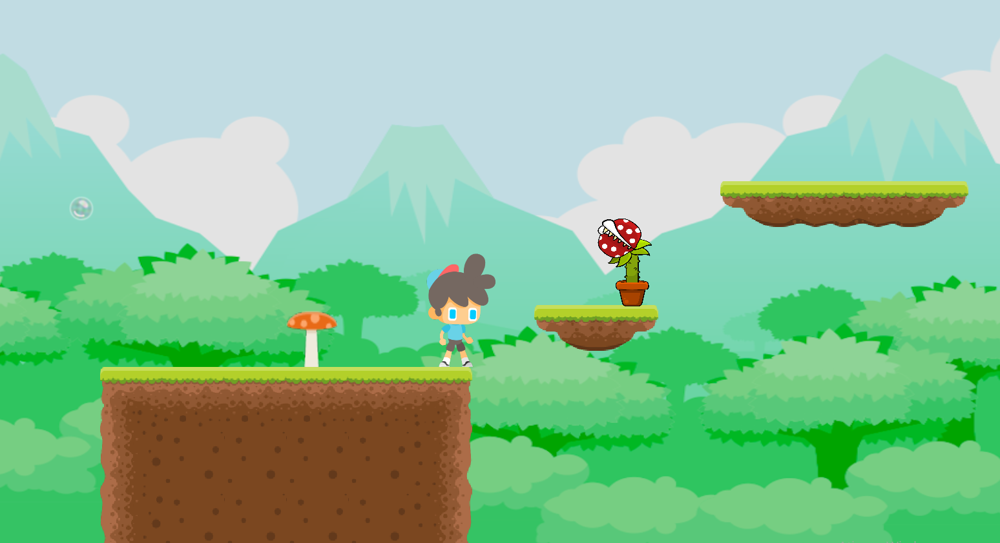

# Beelieve

A fast-paced 2D platformer built with Lua and Love2D.

## About

A challenging platformer with 5 hand-crafted levels of increasing difficulty. New enemies are introduced and platforming becomes more complex as you progress. Reach the flag at the end of each level to advance.

## Features

- **5 Levels** — Progressive difficulty with scaling enemy count and platform complexity
- **Tight Controls** — Coyote timer for forgiving jumps
- **Enemy Variety:**
  - Bees — Patrol back and forth, requiring timing to dodge
  - Plants — Stationary, shoot bubble projectiles on a timer
- **Camera System** — Focused on player, reveals level strategically
- **Physics-Based Movement** — Tuned collision interactions

## Controls

| Key | Action |
|-----|--------|
| ← → | Move |
| Space | Jump |

## Tech Stack

- **Language:** Lua
- **Engine:** Love2D

#Screenshots

<b>Level</b>

  

<table>
  <tr>
    <td align="center" width="25%"><b>Bees</b></td>
    <td align="center" width="25%"><b>Bubbleplant</b></td>
    <td align="center" width="25%"><b>Short Mushroom</b></td>
    <td align="center" width="25%"><b>Tall Mushroom</b></td>
  </tr>
  <tr>
    <td align="center"></td>
    <td align="center"></td>
    <td align="center"></td>
    <td align="center"></td>
  </tr>
</table>

## License

This project was developed for academic purposes.
